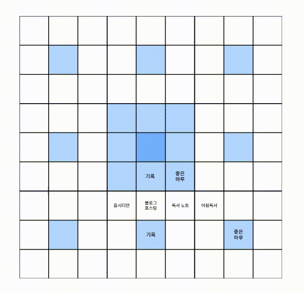

# mandalart
Goal Plannar : Mandalart (Manda-la-art)

## Planning

- Click on a grid which will then guide you to the editing page of that particular section.
- From there, you can input your goals or ideas of a main topic.
- Whatever written should be automatically saved and should be visible when you're back to the main grid.

## Todos
- [x] setup the basic grid - skeleton
- [x] when grid is selected, move to the editing page
    - modified: instead of a new page, it pops up at the middle of all grids.
    - [ ] when editing, set the opacity for backgrounds so that it's not distracting.
- [ ] grid is editable
    - save on click?
    - auto save?
- [ ] edited section is visible from the main grid
- [ ] persistent data; edited data should be there when revisiting.
    - firebase? <-- but i'm not getting any user info. so maybe not firebase.
    - localStorage? JSON?
- [ ] export as JSON
- [ ] import JSON and can edit again
- [ ] save mandalart as .jpg or .png
- [ ] share your mandalart: twitter??
    - I'm not sure how this should be done. save it as an image and share that?? hmmmm..
- [ ] color picker (currently blue-ish is the main theme)